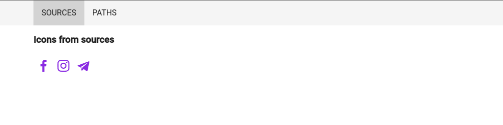

# Angular Samples

This project presents popular solutions for [Angular](https://angular.io).

## Solutions

- [IconService](./libs/core/icons/README.md) - service for creating custom svg icons using Angular Material icons.

- [Redux in Angular. Ngrx vs Ngxs vs Akita.](./apps/redux/dashboard/README.md) - application with different redux implementation on Angular.

A series of articles about redux in russian:

- [Application generation with microfrontends](https://medium.com/fafnur/redux-%D0%B2-angular-%D0%B3%D0%B5%D0%BD%D0%B5%D1%80%D0%B0%D1%86%D0%B8%D1%8F-%D0%BF%D1%80%D0%B8%D0%BB%D0%BE%D0%B6%D0%B5%D0%BD%D0%B8%D1%8F-%D1%81-%D0%BC%D0%B8%D0%BA%D1%80%D0%BE%D1%84%D1%80%D0%BE%D0%BD%D1%82%D0%B5%D0%BD%D0%B4%D0%B0%D0%BC%D0%B8-5e03618e0cc8).
- [Creating Base Classes](https://medium.com/fafnur/redux-%D0%B2-angular-%D1%81%D0%BE%D0%B7%D0%B4%D0%B0%D0%BD%D0%B8%D0%B5-%D0%B1%D0%B0%D0%B7%D0%BE%D0%B2%D1%8B%D1%85-%D0%BA%D0%BB%D0%B0%D1%81%D1%81%D0%BE%D0%B2-e905c4f6354d).
- [Building a Fake News API](https://medium.com/fafnur/redux-%D0%B2-angular-%D1%81%D0%BE%D0%B7%D0%B4%D0%B0%D0%BD%D0%B8%D0%B5-%D1%84%D0%B5%D0%B9%D0%BA%D0%BE%D0%B2%D0%BE%D0%B3%D0%BE-api-%D0%B4%D0%BB%D1%8F-%D0%BD%D0%BE%D0%B2%D0%BE%D1%81%D1%82%D0%B5%D0%B9-11be9cdbea0e).
- [Creating UI components for displaying news](https://medium.com/fafnur/redux-%D0%B2-angular-%D1%81%D0%BE%D0%B7%D0%B4%D0%B0%D0%BD%D0%B8%D0%B5-ui-%D0%BA%D0%BE%D0%BC%D0%BF%D0%BE%D0%BD%D0%B5%D0%BD%D1%82%D0%BE%D0%B2-%D0%B4%D0%BB%D1%8F-%D0%BE%D1%82%D0%BE%D0%B1%D1%80%D0%B0%D0%B6%D0%B5%D0%BD%D0%B8%D1%8F-%D0%BD%D0%BE%D0%B2%D0%BE%D1%81%D1%82%D0%B5%D0%B9-51482a493016).
- [Redux Concepts](https://medium.com/fafnur/redux-%D0%B2-angular-%D0%BA%D0%BE%D0%BD%D1%86%D0%B5%D0%BF%D1%82%D1%8B-%D0%B8-%D0%BF%D0%BE%D0%BD%D1%8F%D1%82%D0%B8%D1%8F-%D0%B2-redux-34834a395265).
- [Recommendations for organizing state](https://medium.com/fafnur/redux-%D0%B2-angular-%D1%80%D0%B5%D0%BA%D0%BE%D0%BC%D0%B5%D0%BD%D0%B4%D0%B0%D1%86%D0%B8%D0%B8-%D0%BF%D0%BE-%D0%BE%D1%80%D0%B3%D0%B0%D0%BD%D0%B8%D0%B7%D0%B0%D1%86%D0%B8%D0%B8-state-2f122e1b8cd).
- [Ngrx in action: building and testing](https://medium.com/fafnur/redux-%D0%B2-angular-ngrx-%D0%B2-%D0%B4%D0%B5%D0%B9%D1%81%D1%82%D0%B2%D0%B8%D0%B8-%D1%81%D0%BE%D0%B7%D0%B4%D0%B0%D0%BD%D0%B8%D0%B5-%D0%B8-%D1%82%D0%B5%D1%81%D1%82%D0%B8%D1%80%D0%BE%D0%B2%D0%B0%D0%BD%D0%B8%D0%B5-82b0f12a0396).
- [Using Ngxs](https://medium.com/fafnur/redux-%D0%B2-angular-%D0%B8%D1%81%D0%BF%D0%BE%D0%BB%D1%8C%D0%B7%D0%BE%D0%B2%D0%B0%D0%BD%D0%B8%D0%B5-ngxs-8a5e330bc41e).
- [Using Akita](https://medium.com/fafnur/redux-%D0%B2-angular-%D0%B8%D1%81%D0%BF%D0%BE%D0%BB%D1%8C%D0%B7%D0%BE%D0%B2%D0%B0%D0%BD%D0%B8%D0%B5-akita-81456b166675).
- [Comparison of different implementations of redux. Ngrx vs Ngxs vs Akita](https://medium.com/fafnur/redux-%D0%B2-angular-%D1%81%D1%80%D0%B0%D0%B2%D0%BD%D0%B5%D0%BD%D0%B8%D0%B5-%D1%80%D0%B0%D0%B7%D0%BD%D1%8B%D1%85-%D1%80%D0%B5%D0%B0%D0%BB%D0%B8%D0%B7%D0%B0%D1%86%D0%B8%D0%B9-redux-ngrx-vs-ngxs-vs-akita-c756c2f2f4a4).
- [Conclusion](https://medium.com/fafnur/redux-%D0%B2-angular-%D0%B7%D0%B0%D0%BA%D0%BB%D1%8E%D1%87%D0%B5%D0%BD%D0%B8%D0%B5-791a07dddc15).

## Documentation

The project uses the following technology stack:

- [Nx Documentation](https://nx.dev/angular) - mono repo;
- [Angular Documentation](https://angular.io/docs) - front-end framework;
- [Angular Material Documentation](https://material.angular.io/components/categories) - material design components for Angular;
- [Ngrx Documentation](https://ngrx.io/docs) - redux state management;
- [Angular Universal](https://angular.io/guide/universal) - server-side rendering on Angular;
- [Jest Documentation](https://jestjs.io/docs/getting-started) - fast unit testing;
- [Cypress Documentation](https://docs.cypress.io/) - e2e framework;
